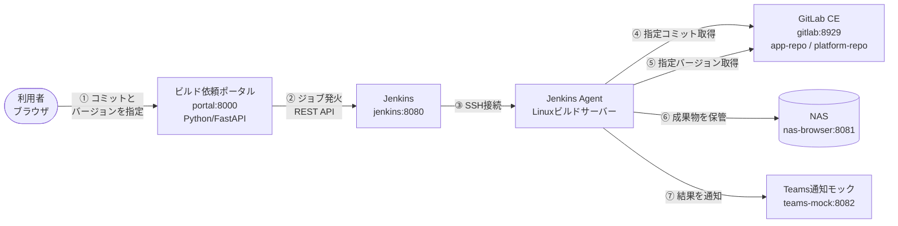

# ビルド環境プロトタイプ

本番想定のビルド環境を「1サーバー = 1コンテナ」で再現したプロトタイプです。
すべての構成をコード(IaC)で管理し、**スクリプト1本(`./setup.sh`)** で
WSL2 上に一括構築できます。すべて商用無料のソフトウェアのみで構成しています。

## 全体像



| コンテナ | 役割 | 本番では |
|---|---|---|
| `portal` | ビルド依頼Webサーバー(Python) | Webサーバー |
| `jenkins` | Jenkins コントローラ | Jenkinsサーバー |
| `jenkins-agent` | ビルド実行サーバー(sshd+JDK+git の素のLinux) | Linuxビルドサーバー |
| `gitlab` | GitLab CE(本物) | GitLabサーバー |
| `nas-browser` | 成果物置き場のHTTP閲覧(ホストディレクトリをバインドマウント) | NAS |
| `teams-mock` | 通知の受信・表示 | Microsoft Teams |

## IaC(Infrastructure as Code)の構成

「どのサーバーがあるか」から「Jenkinsのジョブ定義」まで、全てコードで管理しています。

| 定義するもの | ファイル | 使用技術 |
|---|---|---|
| サーバー構成(6コンテナ) | `docker-compose.yml` | Docker Compose |
| Jenkins プラグイン | `jenkins/plugins.txt` | jenkins-plugin-cli |
| Jenkins 本体設定(ユーザー/認証情報/Agent接続) | `jenkins/casc/jenkins.yaml` | JCasC (Configuration as Code) |
| Jenkins ジョブ定義(ビルドパイプライン) | `jenkins/jobs/platform_build.groovy` | Job DSL + Pipeline |
| GitLab 初期データ(リポジトリ/トークン) | `gitlab/provision/provision.sh` | GitLab API + gitlab-rails |
| 各サーバーの中身 | `*/Dockerfile` | Docker |

手作業での画面設定は一切ありません。`teardown.sh` で全削除してから
`setup.sh` を再実行すると、同じ環境が再現されます。

NAS相当のストレージは Docker named volume ではなく、`.env` の
`NAS_HOST_PATH`(既定は `./nas-data`)で指定した**ホストマシンのディレクトリ**を
そのままバインドマウントしています。ビルド成果物はホスト上に実ファイルとして
残るため、本番のNAS共有ディレクトリと同じ扱いで直接参照・バックアップできます。
本番のNAS(またはその共有ディレクトリ)を直接使う場合は、`NAS_HOST_PATH` に
そのマウントパス(例: `/mnt/nas/builds`)を指定するだけです。

## 構築手順

### 0. 前提: WSL2 + Docker Engine

Windows PC の WSL2(Ubuntu)に **Docker Engine(CE)** を直接インストールします。

> **注意: Docker Desktop は使いません。**
> Docker Desktop は従業員251人以上または年商1,000万ドル超の企業では有償です。
> WSL2 内に Docker Engine を直接インストールすれば Apache-2.0 ライセンスで商用無料です。

```bash
# WSL2 (Ubuntu) 内で実行
# systemd を有効化(未設定の場合)
sudo tee -a /etc/wsl.conf <<'EOF'
[boot]
systemd=true
EOF
# → Windows 側で wsl --shutdown してから WSL を再起動

# Docker Engine のインストール(公式手順)
curl -fsSL https://get.docker.com | sudo sh
sudo usermod -aG docker "$USER"   # 再ログインで反映
```

GitLab CE がメモリを約4GB使用するため、PCのメモリは16GB以上を推奨します。
WSL2 のメモリ上限が足りない場合は Windows 側の `%UserProfile%\.wslconfig` で調整します:

```ini
[wsl2]
memory=12GB
```

### 1. 構築(スクリプト1本)

```bash
git clone <このリポジトリ> && cd build-env-prototype
./setup.sh
```

初回実行時に以下が自動で行われます(所要 約10分。大半はGitLabの初回起動待ち):

1. `.env` の生成(パスワード類は自動生成)と SSH 鍵ペアの作成
2. 全コンテナのビルドと起動
3. GitLab へのリポジトリ・トークンの投入(ダミーのアプリ/プラットフォームリポジトリ)
4. スモークテスト(ポータル経由で1ビルド実行し、NAS保管・Teams通知まで確認)

完了するとアクセスURL一覧が表示されます。

### 2. メンバーのPCから触ってもらう(LAN公開)

1. `.env` の `HOST_ADDR` を Windows の LAN IP に変更し、`./setup.sh` を再実行
2. Windows 側の**管理者 PowerShell** で:

   ```powershell
   cd \\wsl$\Ubuntu\...\build-env-prototype\windows   # またはリポジトリを開く
   Set-ExecutionPolicy -Scope Process Bypass -Force
   .\expose-lan.ps1
   ```

   WSL2 は NAT 内にあるため、Windows のポートを WSL2 へ転送(portproxy)し、
   ファイアウォールの受信許可を設定します。WSL2 を再起動すると IP が変わるため、
   その際は `expose-lan.ps1` を再実行してください。
3. メンバーには `http://<WindowsのLAN IP>:8000/` を案内

元に戻すには `remove-lan.ps1` を実行します。

## デモシナリオ(メンバーへの説明順路)

1. **ポータル** `http://<IP>:8000/` — アプリのコミットとプラットフォームの
   バージョンをプルダウンで選び「ビルド実行」
2. **Jenkins** `http://<IP>:8080/` — ジョブ `platform-build` が動く様子とログ
   (取得 → ビルド → NAS保管 → 通知 のステージが見える)
3. **GitLab** `http://<IP>:8929/` — アプリ/プラットフォームのリポジトリの実体
   (root / `.env` の `GITLAB_ROOT_PASSWORD` でログイン)
4. **NAS** `http://<IP>:8081/` — `builds/` 配下に成果物が保管されている
5. **Teams通知モック** `http://<IP>:8082/` — ビルド結果のカードが届いている
   (成果物へのリンク付き)

## Teams 通知の本番移行について

通知は本番の Teams と同じ **Adaptive Card 形式の JSON を Webhook URL へ POST**
する方式で実装しています(`jenkins/jobs/platform_build.groovy` の `notifyTeams`)。

本番移行時は、Teams のチャネルに Workflows(Power Automate)の
「Webhook 要求を受信したらチャネルに投稿する」を設定して払い出された URL を、
`docker-compose.yml` の `TEAMS_WEBHOOK_URL` に設定するだけです。
通知処理側の変更は不要です。

> 旧来の Office 365 コネクタ(Incoming Webhook)は 2025 年に廃止されたため、
> Workflows(Power Automate)方式を前提としています。

## 本番展開時の考え方

| プロトタイプ | 本番 |
|---|---|
| 各コンテナ | 実サーバー各1台(またはVM) |
| `docker-compose.yml` のサービス定義 | サーバー構成表 / Ansible インベントリ |
| 各 `Dockerfile` の中身 | 各サーバーのセットアップ手順(Ansible プレイブック化) |
| `NAS_HOST_PATH` のホストディレクトリ | NAS の共有ディレクトリ(各サーバーからマウント。既にホスト側の実ディレクトリなので、本番では実際のNASマウントパスに差し替えるだけ) |
| `teams-mock` | Teams の Webhook URL に差し替え |
| JCasC / Job DSL / plugins.txt | そのまま流用可能(Jenkins 標準機能) |

コンテナのまま本番運用する選択肢もあります(その場合は Compose ファイルを
ほぼそのまま利用可能)。実サーバー化する場合も、JCasC・Job DSL・GitLab 投入
スクリプトはそのまま使えるため、Ansible 化するのは「OS設定+ミドルウェア
インストール」の部分だけです。

## よく使うコマンド

```bash
./setup.sh            # 構築(何度実行してもよい)
./setup.sh --no-test  # スモークテストを飛ばして構築のみ
./teardown.sh         # 全削除(データも消す)
./teardown.sh --keep  # 停止のみ(データ保持)
docker compose logs -f jenkins   # 各コンテナのログ確認
docker compose ps                # 状態確認
```

## 社内プロキシ(SSLインスペクション)環境の場合

社内プロキシがTLS証明書を差し替える環境では、社内CA証明書(`.crt`)を
リポジトリ直下の `certs/` に置いてから `./setup.sh` を実行してください。
各イメージのビルド時に自動で信頼されます(1ファイルに1証明書で配置)。
あわせて Docker 側のプロキシ設定(`~/.docker/config.json` の `proxies`)が
必要な場合があります。その際、コンテナ間通信がプロキシへ向かわないよう
`noProxy` にサービス名(`gitlab,jenkins,teams-mock` 等)を含めてください。

## ライセンス(商用無料の確認)

| ソフトウェア | ライセンス |
|---|---|
| Docker Engine / Compose | Apache-2.0 |
| GitLab CE | MIT (Community Edition) |
| Jenkins + 使用プラグイン | MIT |
| Python / FastAPI / uvicorn / httpx | PSF / MIT / BSD |
| nginx | BSD-2-Clause |
| Ubuntu | 無償利用可 |

## トラブルシューティング

- **GitLab がなかなか起動しない**: 初回は3〜5分かかります。
  `docker compose logs -f gitlab` で進行を確認してください。
  メモリ不足の場合は `.wslconfig` で WSL2 への割当を増やしてください。
- **Jenkins Agent がオフライン**: `docker compose logs jenkins-agent` で
  sshd の起動を確認。`secrets/agent_ssh_key` を作り直した場合は
  `docker compose up -d --force-recreate jenkins-agent jenkins` を実行してください。
- **メンバーのPCから繋がらない**: `expose-lan.ps1` を再実行(WSL2のIPは
  再起動で変わります)。Windows のファイアウォール設定も確認してください。
- **ポートが衝突する**: `.env` のポート番号を変更して `./setup.sh` を再実行
  (`windows/expose-lan.ps1` の `$ports` も合わせて変更)。
